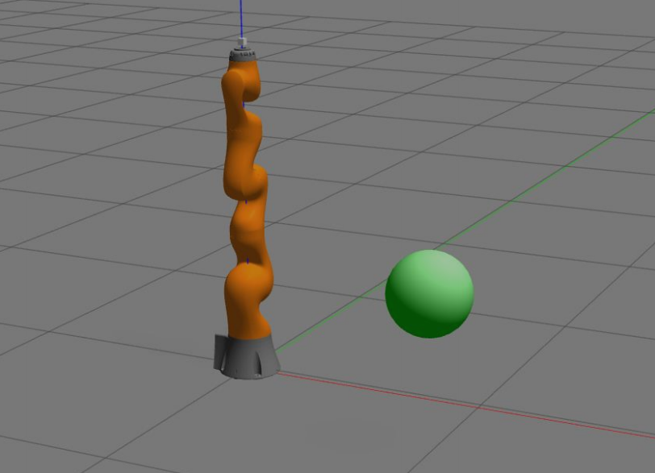
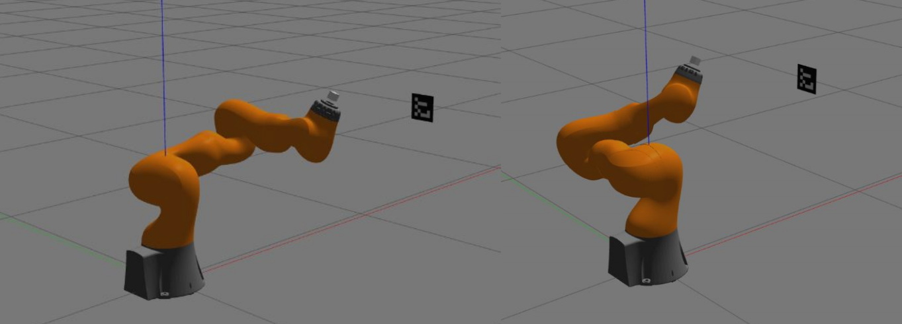

## Robotics Lab Homework 3

### 1. Creating and Detecting a Circular Object in Gazebo

  

**a) Model Creation and Placement:**
- **Modeling:** Created a circular object with a 15 cm radius, designed as a green-colored sphere. Configured the object as static to prevent it from falling during the simulation.
- **World Integration:** Added the model to a new Gazebo world file at coordinates (x=1, y=-0.5, z=0.6) and oriented it for visibility from the robot's camera view.

**b) Launch File Configuration:**
- **Launch File:** Developed a new launch file to load the robot with a camera into the new Gazebo world. Ensured that the robot's camera could view the circular object by specifying the correct paths for the world file and model directories.

**c) Object Detection with OpenCV:**
- **Image Processing:** Modified the `opencv_ros` package to detect the circular object in the camera feed. Applied blob detection to identify the object and republished the processed image with detected blobs.

### 2. Modifying the Look-at-Point Vision-Based Control Example

**a) Vision-Based Control Implementation:**
- **Control Law Development:** Adjusted the `kdl_robot_vision_control` node to align the robot’s camera with an Aruco marker. Implemented a control law to compute position and orientation errors, adjusting joint velocities to maintain marker alignment.

**b) Improved Look-at-Point Algorithm:**
- **Advanced Control Law:** Developed an enhanced control law using the null space matrix to ensure stable camera orientation while tracking the marker. This approach accounted for manipulator velocities and ensured consistent alignment.

**c) Dynamic Vision-Based Controller Development:**
- **Merged Controllers:** Implemented a dynamic vision-based controller by integrating joint space and Cartesian space inverse dynamics controllers. Enabled the robot to track a linear trajectory while aligning the camera with the Aruco marker. Plotted joint torques and Cartesian error norms to assess performance.

  

